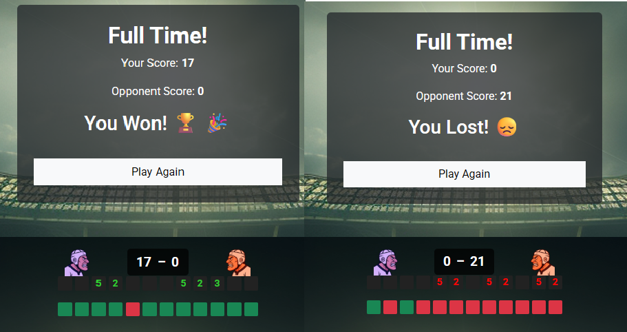
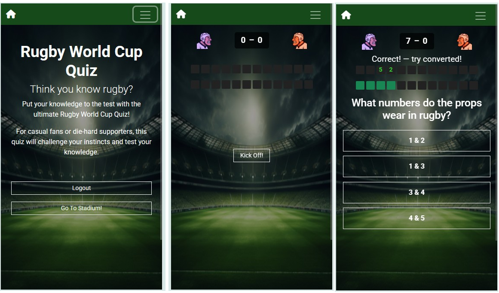
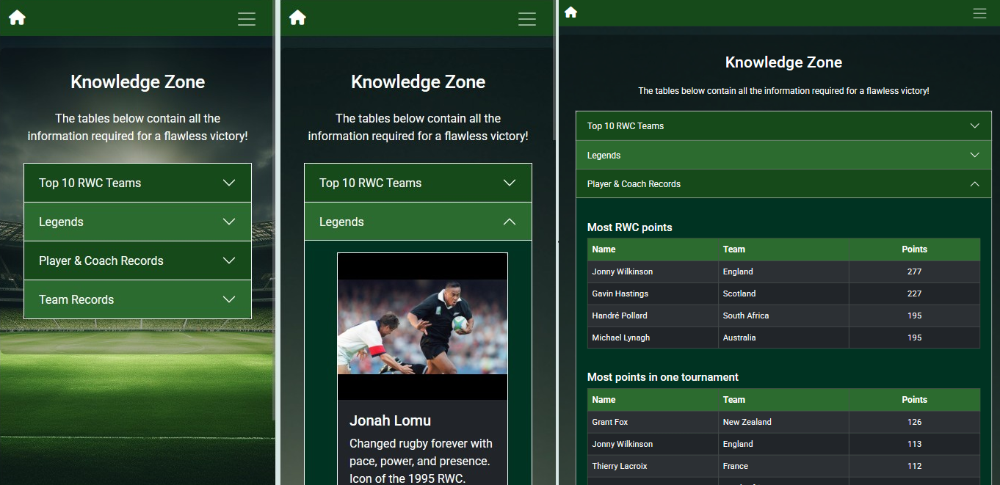

# Rugby World Cup Quiz

This is a mobile-first, interactive Rugby World Cup quiz I built as part of my web development course. It’s designed to be fun, fast-paced, and rugby-themed — with scoring inspired by real match play.



---

## How it Works

- 12 multiple-choice questions per match
- Questions are pulled from a set of pre-written quiz questions
- Scoring is streak-based (like rugby):
  - 3 correct = Try (5 pts)
  - 4 correct = Conversion (2 pts)
  - 5 correct = Penalty Kick (3 pts)
  - Wrong answers give the *opposition* a chance to score


### How I Created the Question Set

To build the question set efficiently:
- I wrote all the **question, options, correct answer, and difficulty level** data in a **Google Sheet**
- Then I created and used a custom **formula in the sheet** to convert each row into the correct **JavaScript format**
- From there, I simply **copied and pasted the formatted output** directly into the `rugbyQuestions` array in my JS file

> This helped save time, avoid typos, and make edits easier as the quiz grew

## Knowledge Zone

I also included a "Knowledge Zone" with expandable accordion sections where you can learn more about:
- Teams
- Rugby legends
- Player records
- Team records

Each section includes visuals and tables, designed to be responsive and easy to read on mobile.




## Tech Stack

### Frontend
- HTML5
- CSS3 / Bootstrap 5
- JavaScript (ES6)

### Design, formatting & UI Testing
- Snipping Tool (Windows) – for UI screenshot capture
- Google Chrome DevTools – for live debugging, inspecting DOM/CSS, and performance checks
- HTML Formatter – to format and clean HTML code
- CSS Formatter – to format CSS for readability
- W3C HTML Validator – to check for valid HTML
- W3C CSS Validator – to validate stylesheets
- Online photo editor to resize and edit icons and photos

### Development Environment
- Visual Studio Code
- Git & GitHub for version control

### Hosting
- GitHub Pages

## Features

- Login/signup using localStorage
- Access control: users must log in to play
- “Kick Off” launches the quiz UI
- Progress bar and score system modeled on rugby scoring
- Feedback messages for streaks and errors
- Final score screen with result

## Sources of Information

I created all the questions manually using public information and facts from the following:

- [Rugby World Cup official site](https://www.rugbyworldcup.com/)
- [World Rugby](https://www.world.rugby/)
- BBC Sport Rugby Union archives
- Stats and records from **Wikipedia** and **ESPN Scrum**
- Rugby articles and player profiles from **The Guardian**, **Sky Sports**, and **RugbyPass**

> *Note:* All data was cross-referenced to be accurate at time of writing. This quiz is purely educational/fan-made.

## Images and Visuals

- Images used in the **Knowledge Zone** and quiz UI were collected or generated from:
  - **ChatGPT** – for creating icon ideas and stadium backgrounds
  - **Pinterest** – inspirational rugby-themed images
  - **Wikimedia Commons** – public domain rugby images
  - **Unsplash** – high-quality background photos
- Fonts from [Google Fonts](https://fonts.google.com/)
- Icons from [Font Awesome](https://fontawesome.com/)

> This project is non-commercial, for learning purposes only. If any images need credit or removal, I’ll be happy to update it.

---

## Try It

[Live Demo on GitHub Pages](https://your-username.github.io/rugby-quiz)

---

## What I’d Improve Next

- Add match difficulty selection (I have 90 questions in total with each question rated easy/medium/hard)
- Add scoring streaks based on difficulty level selected
- Let users choose a team and opponent and track results
- Save player performance over time (store on server)
- Improve accessibility and keyboard navigation
- Add audio or animations

---

## How to Run Locally

```bash
git clone https://github.com/your-username/rugby-quiz.git
cd rugby-quiz
```
Then just open `index.html` in your browser.

---

## References & Tools Used

Throughout this project I used several tools and websites to support learning, design, testing, and deployment:

- [ChatGPT](https://chat.openai.com) – for help with JavaScript logic, UI/UX decisions, bug fixing, accessibility advice, and also to generate custom icon ideas and stadium imagery
- [W3Schools](https://www.w3schools.com/) – for quick reference on HTML, CSS, JavaScript, and Bootstrap examples
- [WebAIM Contrast Checker](https://webaim.org/resources/contrastchecker/) – to check color contrast and improve accessibility
- [JSHint](https://jshint.com/) – to validate JavaScript and enforce ES6 syntax
- [JSFiddle](https://jsfiddle.net/) / [CodePen](https://codepen.io/) – for quick testing and debugging of layout or logic
- [Google Sheets](https://sheets.google.com) – used to write the quiz questions and apply formulas to format them for JavaScript
- [Pinterest](https://www.pinterest.com/), [Wikimedia Commons](https://commons.wikimedia.org/), and [Unsplash](https://unsplash.com/) – for images and generated visuals used in the UI and Knowledge Zone (non-commercial use)
- [Font Awesome](https://fontawesome.com/) / [Google Fonts](https://fonts.google.com/) – for icons and typography
- [GitHub Pages](https://pages.github.com/) – used to host and publish the project publicly
- [Balsamiq](https://balsamiq.com/) – for sketching rough wireframes during early design planning
- [CSS Formater](https://www.cleancss.com/css-beautify/) – for formatting CSS code
- [HTML Formater](https://htmlformatter.com/) – for formatting HTML code
- [W3C HTML Validator](https://validator.w3.org/) – to check for valid and accessible HTML
- [W3C CSS Validator](https://jigsaw.w3.org/css-validator/) – to validate stylesheets
- [Photopea](https://www.photopea.com/) – for editing images and photos 

> This quiz was created for learning purposes. All imagery and content used is either generated, open source, or cited. If anything requires credit or removal, I’ll update it.

---


---

## Accessibility Check

This project follows [WCAG 2.1 Level AA](https://www.w3.org/TR/WCAG21/) accessibility guidelines.

### Color Contrast Checked

- `#FFFFFF` on `#2C6B2F` — Contrast ratio: **6.45:1**  
  Passed **AA & AAA** for normal text

Tested using the [WebAIM Contrast Checker](https://webaim.org/resources/contrastchecker/?fcolor=FFFFFFFF&bcolor=2C6B2F).


## Built By

I'm learning front-end web development through a coding diploma. This project was part of my JavaScript module, and it helped me learn about game logic, UI/UX, and responsive layout.

Still trying to improve it week by week.
